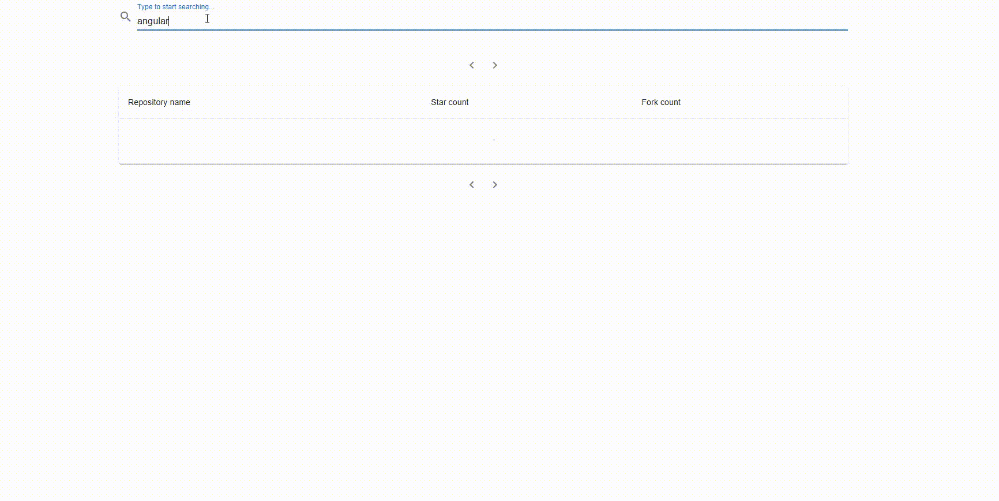

# FE evaluation task

## Prerequisites

- node: 21.1.6
- npm: 10.2.4
- github personal token with repo/public_repo privileges

## How to run

From the root directory of project run command: `npm install`.

Next step is to add `.env.local` file. In root directory you will find `.env.local.sample`. You can simply rename it to `.env.local` and replace `<github token>` with your github token.\
 Without proper token, you still will be able to run project, but you won't be able to fetch any data.

It will start application in the development mode, working under port 3000. http://localhost:3000 is address under project is accesible once dev server is running

## Building

Application is build by running `npm run build` command. And it's result you'll find in `build` directory after execution.

## Project testing

Project contains unit tests and e2e tests for live data testing.

Unit tests with all the coverage information are run from root directory with command `npm run test-unit`.

If you'd like to run e2e tests, first you'll need your application running. You can run it with instruction suggested in the beginning, or you can use docker image for this purpose, which will run it on port `3000` as well.

All the commands are executed from root directory. To run docker image first you'll need to build it with command: `docker build -t fe-build-and-test .`

Next you start the container by running: `docker run -d -p 3000:3000 fe-build-and-test`

It might take a while, before application starts. After a while you should be able to access the application in the browser under the address: `http://localhost:3000`.

To run cypress e2e test you'll to run command: `npm run test-e2e`

## Libraries used

- @apollo/client - GraphQL client for handling graphql query
- @mui/material and @mui/icons-material - as a design system for UI presentation of data
- cypress - for E2E testing
- React Router - to provide routing capabilities
- husky, eslint, prettier, typescript-eslint - for static code analysis, and aligning the code to the best practices, as well to provide autoformatting. `husky` has been used for pre-commit checks (linting and unit testing)
- @toolpad/core - for notification displaying (error handling on UI)
- cross-env - for system cross compatibility of running script that set ENV variables
